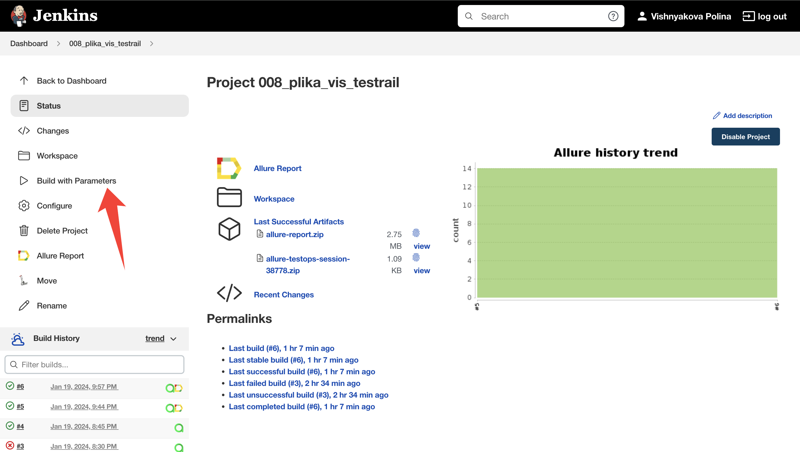
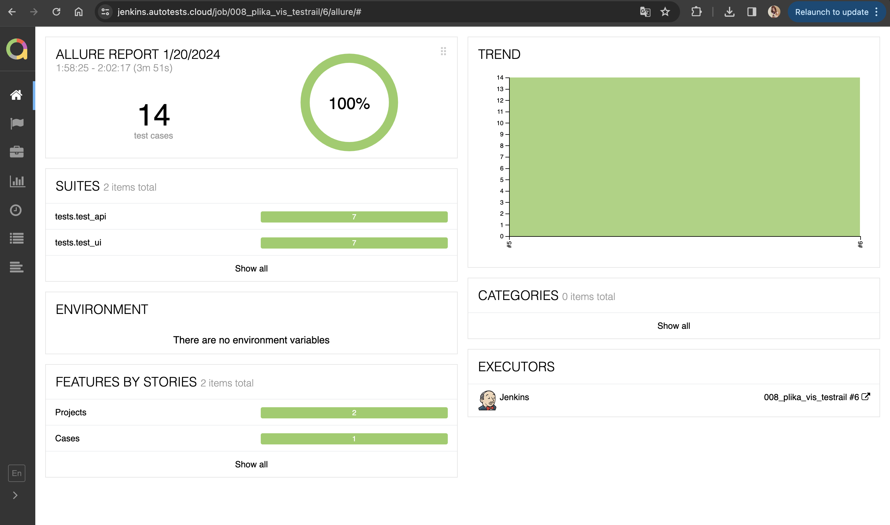
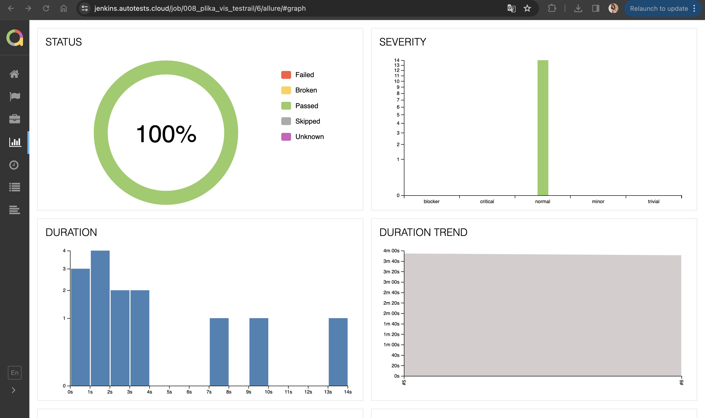
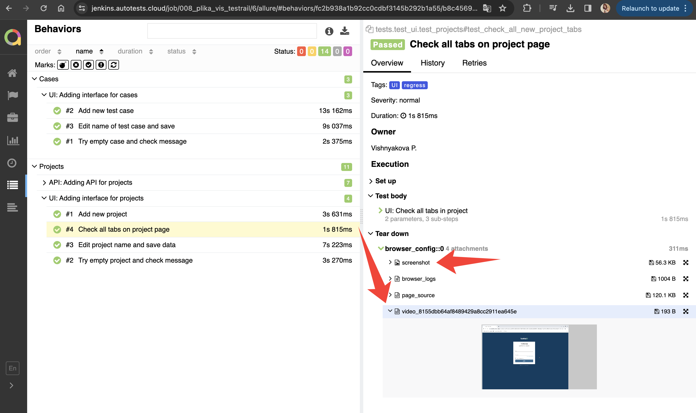
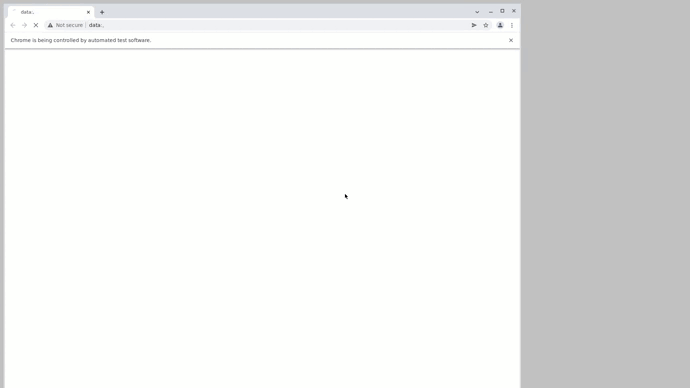
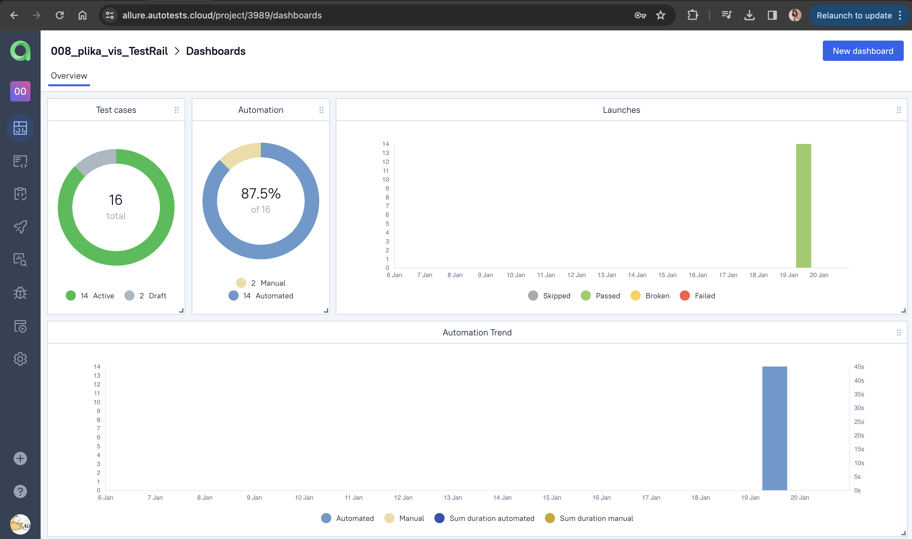
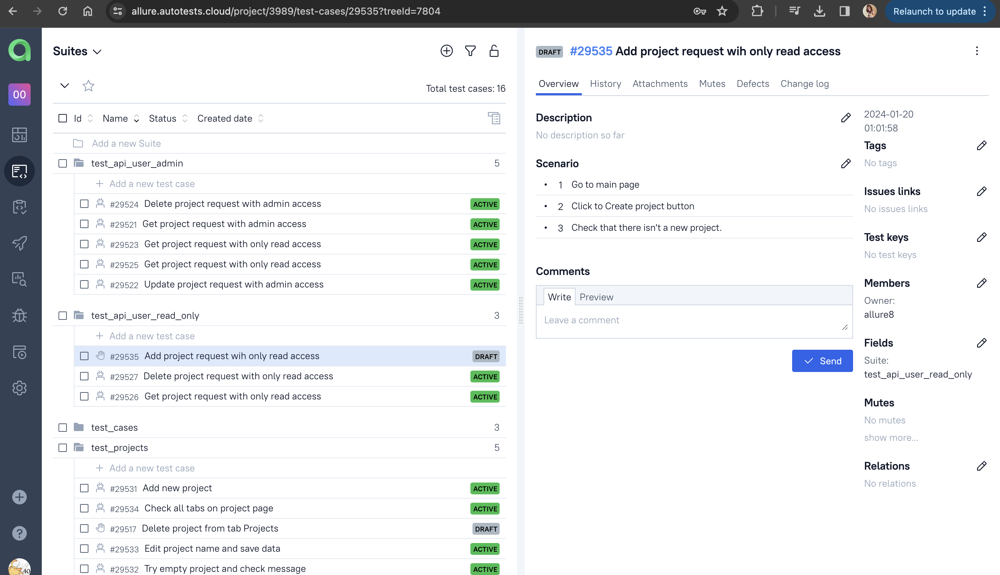
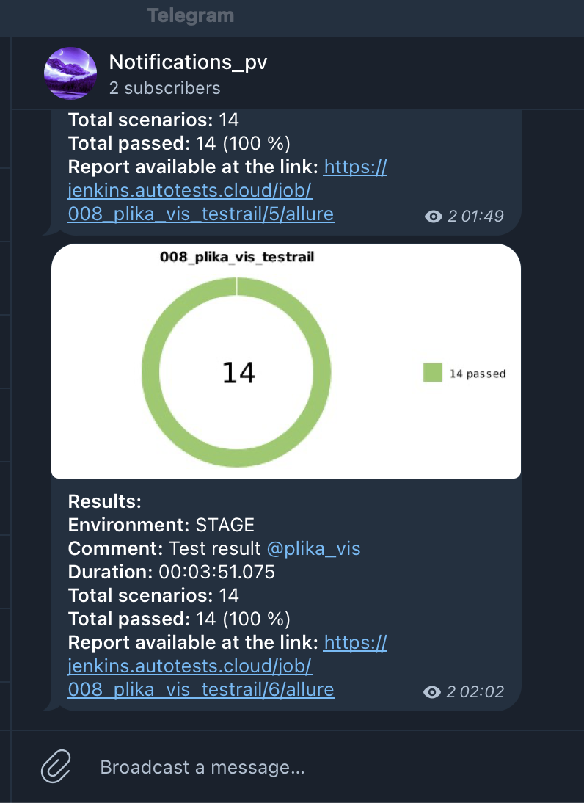

## Проект UI и API автотестов TestRail.com 

<!-- Технологии -->

  <code></code>
  <code></code>
  <code></code>
  <code></code>
  <code></code>
  <code></code>
  <code></code>
  <code></code>
  <code></code>
  <code></code>
  <code></code>
  <code></code>

<!-- Тест кейсы -->
### Что проверяем
UI-тесты:
* Создание нового проекта 
* Создание проекта с некорректными данными и сообщение об ошибке
* Редактирование проекта и сообщение об успешном обновлении данных
* Работу всех вкладок на странице проекта  
* Создание нового тест-кейса
* Создание нового тест-кейса с пустым названием и сообщение об ошибке
* Редактирование тест-кейса и сообщение об успешном обновлении данных

API-тесты: 
## [Documentation](https://support.testrail.com/hc/en-us/articles/7077792415124-Projects)
* Работу системы под пользователем с полными правами и правами на чтение
* Отправку запросов 
* Тело ответа (реализована проверка на json-схему)
* Код ответа
* Тело ответа (реализована проверка на json-схему)
* Данные в ответе 

###  Запуск проекта в Jenkins

### [Job](https://jenkins.autotests.cloud/job/008_plika_vis_testrail/)

##### При нажатии на "Собрать сейчас" начнется сборка тестов и их прохождение, через виртуальную машину в Selenide.

<!-- Allure report -->

###  Allure report
### [Report](https://jenkins.autotests.cloud/job/008_plika_vis_testrail/)
##### После прохождения тестов, результаты можно посмотреть в Allure отчете, ссылка так же содержится  на Jenkins

##### Во вкладке Graphs можно посмотреть графики о прохождении тестов, по их приоритезации, по времени прохождения и др.

##### Во вкладке Suites находятся собранные тест кейсы, у которых описаны шаги и приложены логи, скриншот и видео о прохождении теста

##### Видео прохождение теста

<!-- Allure TestOps -->

###  Интеграция с Allure TestOps

### [Dashboard](https://allure.autotests.cloud/project/2291/dashboards)

##### Так же вся отчетность сохраняется в Allure TestOps, где строятся аналогичные графики.

#### Во вкладке со сьютами, мы можем:
- Управлять всеми тест-кейсами или с каждым отдельно
- Перезапускать каждый тест отдельно от всех тестов
- Настроить интеграцию с Jira
- Добавлять ручные тесты и т.д

<!-- Telegram -->

###  Интеграция с Telegram
##### После прохождения тестов, в Telegram bot приходит сообщение с графиком и небольшой информацией о тестах.

